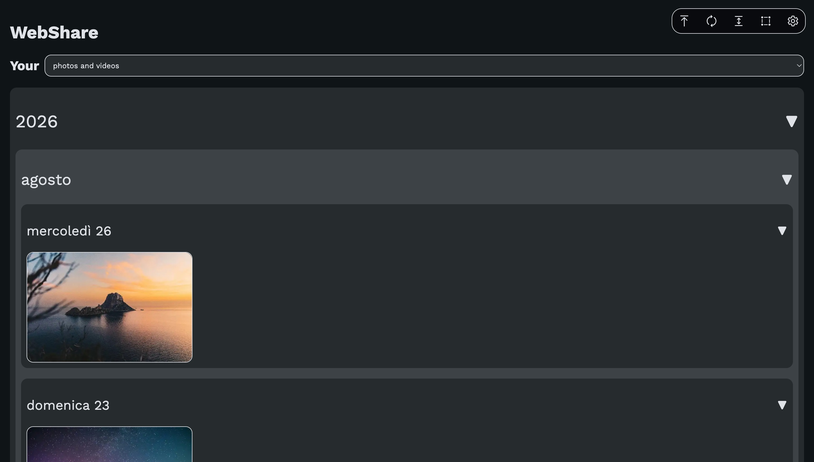
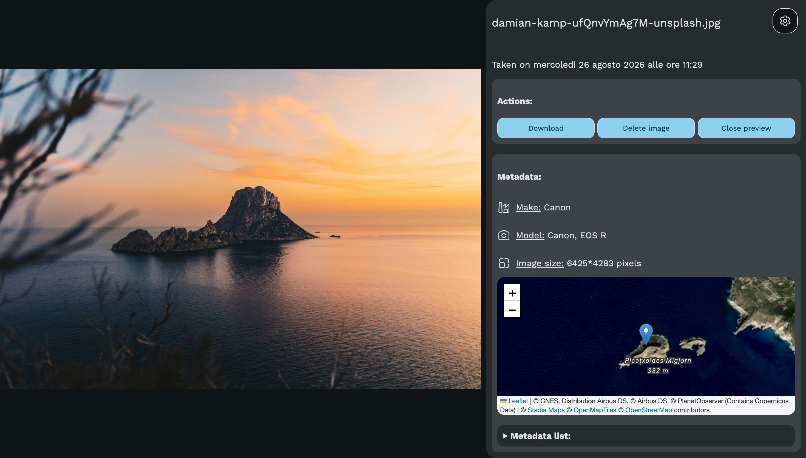
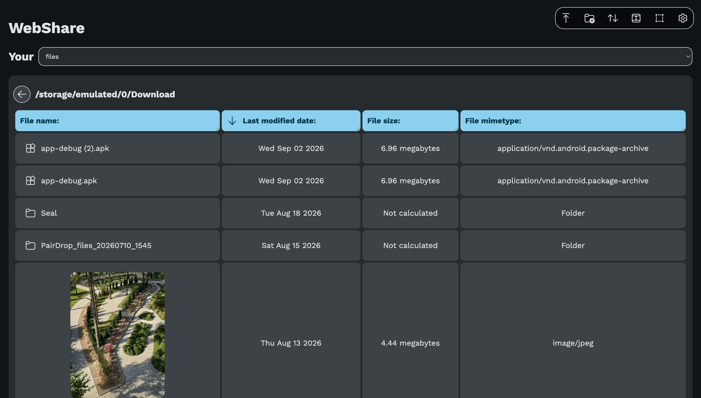
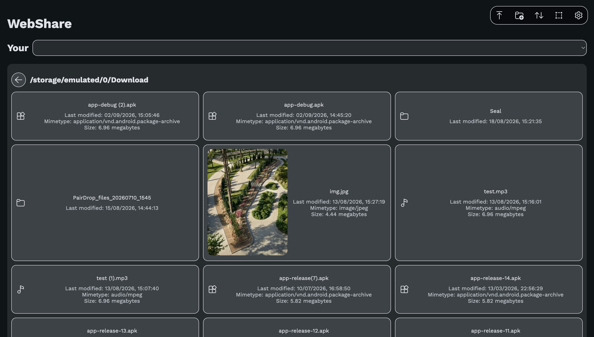
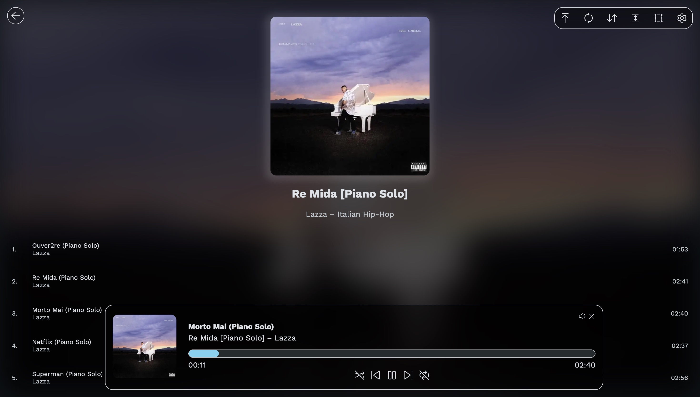

# WebShare

WebShare is an Android application that permits to access to the photos, videos, audios and files saved on your phone from any device connected to the same Wi-Fi network.

## Features

- Download one or multiple images/audios/files;
- View images divided by album and/or year/month/day;
- Listen to the music saved on your device without downloading it;
- Delete images/audio/files;
- View all the metadata of your photos and videos;
- Upload new photos, videos, audios or files;
- And more.

## Usage

Open the WebShare Android application, and click on the `Start server` button. You'll see a link in bold: enter it on your other device, and now click on the `Get authorization code` button. Copy the 8-digit code you can see on your phone in the authorization field you can see on your other device, and you're done! See below all the [web app sections](#sections).

## Installation

The easiest way to install WebShare is by downloading the APK from GitHub Releases. However, you can find build instructions below.

### Build instructions

First, you'll need to build the web app: install node.js, and then run the `npx vite build` command from the `web-app` folder. You'll find some files in the dist folder: copy them in the `android-app/src/main/res/raw` folder. Now, you can build the APK using Android Studio (or any other application that permits to build Android APKs).

## Sections

### Images section

In the images section, you can see all the images stored on your device, divided by year, month, and day. You can collapse a year/month/day you don't care about by clicking on its name.

From the top-right buttons, you can:
- Upload new photos and videos;
- Refresh the loaded images;
- Change the height of each displayed image;
- Enable "Select" mode, so that you can download or delete multiple images or videos;
- Go to the Settings.

#### Photo preview

If you click on a photo or on a video, you'll be able to see it in full size. If you open a video, you'll see all the video controls.

You'll also see the metadata of that photo/video, including the location where the picture was taken.

### Album section

The Album section permits to divide each photo/video by their folder. When an album is clicked, you'll see the same interface of the [Images section](#images-section), and therefore you'll be able to do the same things.

### Files section

| Table Mode | Grid Mode |
| - | - |
|  |  |

In the Files section, you can see all the files saved both on your device and on connected drives (including virtual drives, like the ones created by apps like Termux). With the buttons in the top-right corner, you can:

- Upload new files or a new folder;
- Create a new folder;
- Sort files (by their last modified date, by their name etc.);
- Change the table width (if table mode is enabled);
- Select one or more files, so that you can download or delete multiple files;
- Go to the Settings.

If possible, the application will generate a preview of the files. You can disable this behavior in the Settings.

### Music section

Just like in the Files section, also here you can display your music files both in a table and in a grid, and you can also divide them by track/artist/album artist/album. Also the top-right commands are basically the same: what really changes is what happens when you click on an album name: you'll see all the tracks of that album. By clicking on one of them, a pop-up audio player will appear, where you'll be able to skip tracks, enable shuffle/repeat mode, change the volume etc.

## Privacy

WebShare does not share any data with third-parties: your files always stay within your local network. The application only connects to an external server to check if updates are available.